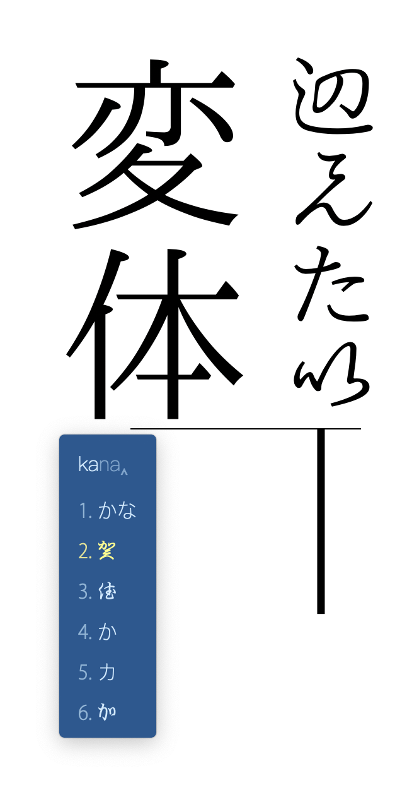
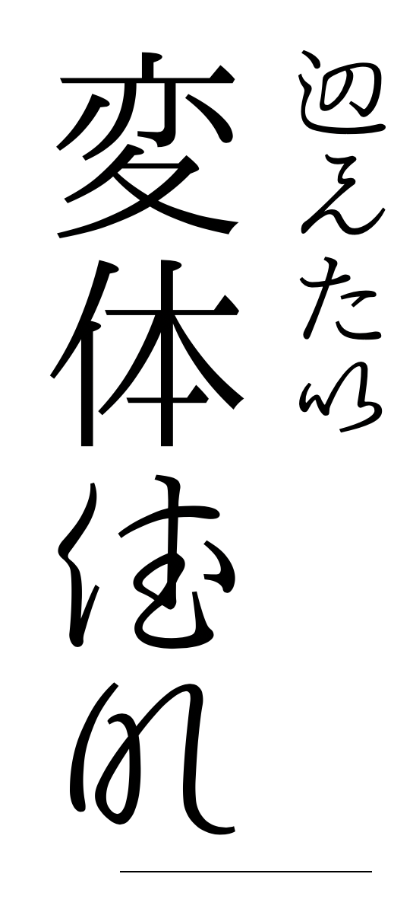

<p align="center"></p> 

# rime-hentaigana: <ruby>仮名集<rt>Kana Syū</ruby>（変体仮名、台湾語仮名、アイヌかな等をサポート）

Input method of the complete set of kana, including hentaigana and other less used kana sets, like those in 台湾語仮名. 

## Installation

Install [rime](https://rime.im/) input engine if you have not. 

### Installing Plum:

```bash
curl -fsSL https://git.io/rime-install | bash
```

### Install  `rime-hentaigana` via Plum:

```bash
cd plum
bash rime-install edward-martyr/rime-hentaigana
```

Please check if the `opencc` folder is in the correct position if the kanji function of this input method is malfunctioning. 

## Functions

### Kana

- Input of modern kana
- Input of hentaigana (Kana Extended-A `1B100–1B12F` & Kana Supplement `1B000–1B0FF`)
  - 𛀀, 𛀄, etc. 
- Input of 踊り字/繰り返し符号 marks
  - 〃, 々, ヽ, ゞ, 〴〵, etc. 
- 台湾語仮名
  - パ̣行 etc. 
- アイヌ語仮名
  - ㇱ, ㇲ, ㇳ, etc. 
  - ㇵ行
  - ㇻ行

### Kanji

In the menu you can switch from かな to 漢字 mode, which uses the `opencc` functionality to input kanji corresponding to hentaigana. 

## Tip

- The dictionary is written using strictly phonological romanisation, e.g. using `sy-` for しゃ行, and `tu` for つ. 

- Install a font file that supports hentaigana if you haven't yet. For example, [一点明朝](https://github.com/ichitenfont/I.Ming), [IPAmj明朝](https://mojikiban.ipa.go.jp/1300.html) could work. 

## Examples

Rendered using Pages on Mac:

| Inputting                                        | Result                                        |
| ------------------------------------------------ | --------------------------------------------- |
|  |  |

